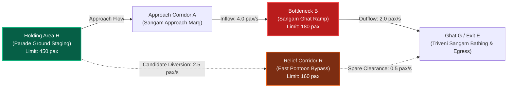

# SENTINEL AI
## Action-Aware Crowd Disaster Prevention & Incident Copilot for Mass Gatherings
### Google Cloud AI Builder Cup 2026 — Sustainability & Social Impact (SDG 11: Sustainable Cities & Communities)
### Smart India Hackathon (`SIH26206`) — Software — Disaster Management

[](https://www.python.org/downloads/)
[](https://flask.palletsprojects.com/)
[](https://cloud.google.com/vertex-ai)
[](https://cloud.google.com/run)
[](https://github.com/ultralytics/ultralytics)
[-purple.svg)](https://www.sqlite.org/wal.html)
[-brightgreen.svg)]()

> **Primary Operational Deployment Target:**  
> **Maha Kumbh Mela Prayagraj (2025–2026) — Sector 04 (Sangam Triveni Ghat & Parade Ground Pilot)**  
> *Developed by Team X Factor — MIT School of Computing*  
> *Authority: `Sentinel_AI_SIH2026_Final_Strategy_Report.pdf` (17-page Architecture Specification, 09 Sep 2026)*

---

## 1. Executive Summary & Core Product Thesis

### What Sentinel AI Is
Sentinel AI is an **offline-first, action-aware crowd-flow decision-support system and Generative AI Incident Copilot** engineered for mass-gathering disaster risk reduction (DRR) and multi-agency response coordination.

Built specifically for high-density religious congregations such as the **Maha Kumbh Mela Prayagraj**, Sentinel AI observes developing pilgrim accumulation, forecasts time to configured sector operating limits using transparent mass-conservation flow equations, compares candidate operational interventions across connected corridors, **automatically rejects actions that would transfer congestion into secondary bottlenecks (such as pontoon bridges or ghat ramps)**, explains decisions via **SENTINEL Incident Copilot (Google Gemini 2.0 Flash)** grounded in official **NDMA Section 4.2 SOPs**, and enforces an auditable human-in-the-loop operational lifecycle.

```
       +-----------------------------------------------------------------------+
       |                           THE CORE QUESTION                           |
       |                                                                       |
       |     "Most crowd systems tell you where congestion is high.            |
       |      Sentinel asks the next operational question:                     |
       |      IF I MOVE THIS CROWD SOMEWHERE ELSE, WILL I CREATE              |
       |      THE NEXT DANGEROUS BOTTLENECK?"                                  |
       +-----------------------------------------------------------------------+
```

### What Sentinel AI Is NOT (Scientific Seam & Honesty Boundaries)
In strict accordance with disaster management science and Indian mass-gathering guidelines (NDMA, BPR&D, NIDM):
- **NOT a universal stampede predictor:** No camera system can predict individual human injury or the physics of crowd collapse.
- **NOT a fabricated countdown:** Sentinel AI never generates sensational "time to crush" countdowns or arbitrary "95% confidence" claims. It calculates the **Time to Configured Operating Limit ($T_{\text{limit}}$)** under explicit, inspectable rate assumptions.
- **NOT autonomous crowd control:** Sentinel AI never actuates physical barricades or overrides police command. It provides structured decision support to the **Sector Magistrate, NDRF commanders, and Police Marshals**.
- **NOT an unchecked LLM decision-maker:** Google Gemini sits strictly **ABOVE** the deterministic safety engine. Gemini translates verified machine state into grounded tactical briefs and multilingual public announcements; it **never** makes feasibility or capacity clearance decisions.
- **NOT a fragile cloud-only system:** Sentinel AI executes 100% locally on edge hardware with SQLite WAL persistence. If the WAN or Gemini API drops, the core safety plane continues with zero degradation.

---

## 2. Operational Domain: Maha Kumbh Mela Prayagraj (Sector 04 Pilot)

The primary pilot environment modeled in Sentinel AI is **Sector 04 (Sangam Triveni Ghat & Parade Ground)** at the Maha Kumbh Mela in Prayagraj, India. During peak bathing days (*Shahi Snan* / *Mauni Amavasya*), millions of devotees converge toward the sacred confluence of the Ganga, Yamuna, and Saraswati rivers.

### Modeled Sector 04 Topology



1. **Holding Area H (Parade Ground Pilgrim Staging Enclosure):** Upstream reservoir with configured operating limit of 450 persons. Used for upstream pacing and flow metering.
2. **Approach Corridor A (Sangam Approach Marg):** Main arterial feeder linking the staging grounds to the riverbanks.
3. **Bottleneck B (Sangam Ghat Descent Chokepoint / Ramp):** Heavily constrained transition ramp leading onto the bathing platform. Configured operating limit: 180 persons.
4. **Ghat Area G & Exit Corridor E (Triveni Sangam Bathing Area & Egress):** Sacred confluence bathing area and downstream dispersal corridor.
5. **Relief Corridor R (East Pontoon Bridge Bypass):** Alternate floating pontoon bridge bypass. Configured operating limit: 160 persons.

*Historical Note on Prior Work:* The prior engineering prototype developed for Indian Railways passenger foot-over-bridge (FOB) monitoring is retained strictly as laboratory baseline evidence. The operational deployment target is Maha Kumbh Mela mass-gathering disaster prevention.

---

## 3. End-to-End System Architecture

Sentinel AI separates sensing uncertainty from deterministic flow physics, grounded GenAI communication, and multi-agency human authorization:

```
 CCTV / REPLAY (CAM-01 to CAM-04)
        │
        ▼
 YOLOv8 Person Detection & 4x6 Grid Tracking [OBSERVED CCTV SIGNAL]
        │
        ▼
 Flow Forecast Engine [CALCULATED] ──► T_limit = (C - N) / g
        │
        ▼
 Decision Safety Layer (The Differentiator)
 [Capacity Constraints · Route Validity · Secondary Bottleneck Checks]
        │
        ├──► REJECTED: Diversion to Relief Corridor R (overload @ 48s)
        └──► FEASIBLE: Upstream Metering at Holding Area H (+205s wait)
        │
        ▼
 SENTINEL INCIDENT COPILOT (Google Gemini 2.0 Flash / Vertex AI)
 Grounded in: NDMA Section 4.2 Guidelines & Kumbh Sector 4 SOPs
 ├── Rationale Explanation: Explains secondary bottleneck physics
 ├── Command Briefing: Sector Magistrate executive tactical summary
 ├── Multilingual Operations: English, हिन्दी (Hindi), मराठी (Marathi)
 └── Public Address Draft: Reassuring, non-sensational wayfinding
        │
        ▼
 HUMAN-IN-THE-LOOP LIFECYCLE (Audited in SQLite WAL)
 PROPOSED ──► APPROVED ──► DELIVERED ──► ACKNOWLEDGED ──► COMPLETED ──► VERIFIED
        │
        ▼
 Post-Action Sensor Verification (CCTV Delta Confirms Queue Stabilization)
```

---

## 4. SENTINEL Incident Copilot (Meaningful Google GenAI)

Unlike generic chatbots, the **SENTINEL Incident Copilot** sits strictly **ABOVE** the deterministic safety engine:
- **Architectural Placement**: It receives structured machine state (counts, capacities, growth rates, candidate statuses) and official NDMA SOP guidelines.
- **AI Safety Contract**:
  - Never overrides deterministic rejections (if marked `REJECTED`, Gemini cannot approve it).
  - Never predicts stampede physics or invents counts/capacities.
  - Rejects sensational or panic-inducing phrasing.
- **Degraded Mode Resilience**: If Gemini is unreachable or WAN is severed, local edge safety functions continue with zero interruption. The UI displays: `COPILOT UNAVAILABLE — DETERMINISTIC DECISION SUPPORT CONTINUES`.

### Grounded SOP Knowledge Layer (`src/knowledge_base.py`)
Provides deterministic citations from the National Disaster Management Authority (NDMA) Section 4.2:
- `SOP-NDMA-042-A`: Chokepoint Inflow Metering at Pilgrim Staging Area.
- `SOP-NDMA-042-B`: Secondary Bottleneck & Divergent Route Capacity Guard.
- `SOP-NDMA-042-C`: Pontoon Bridge Unidirectional Egress Enforcement.
- `SOP-NDMA-042-D`: Holding Area Staging & Pilgrim Welfare Maintenance.
- `SOP-NDMA-042-E`: Public Address Calming & Wayfinding Protocol.

---

## 5. Mathematical Formulation & The Reference Worked Scenario

### 5.1 Zone Flow Conservation Equation
For any named zone $i$ over discrete time step $dt$:
$$\Delta N_i = dt \times \left[ \sum q_{\text{in}} - \sum q_{\text{out}} + \text{arrivals} - \text{departures} \right]$$
$$N_i(t + dt) = N_i(t) + \Delta N_i$$

### 5.2 Time to Configured Operating Limit ($T_{\text{limit}}$)
For a zone with current headcount $N$, configured operating limit $C$, and net inflow rate $g = q_{\text{in}} - q_{\text{out}}$:
$$T_{\text{limit}} = \frac{C - N}{g} \quad (\text{for } g > 0 \text{ and } N < C)$$

### 5.3 The SIH Reference Worked Scenario (Strategy Report Page 9)
This exact scenario is embedded and demonstrable in the Sentinel AI interface:

| Parameter / Zone | Initial State | Transition Dynamics | Decision Safety Layer Outcome |
|---|---|---|---|
| **Bottleneck B (Ghat Ramp)** | $N_B(0) = 120\text{ pax}$<br>Limit $C_B = 180\text{ pax}$ | $q_{\text{in}} = 4.0\text{ pax/s}$<br>$q_{\text{out}} = 2.0\text{ pax/s}$<br>Net $g = +2.0\text{ pax/s}$ | $T_{\text{limit}} = \frac{180 - 120}{2.0} = \mathbf{30.0\text{ seconds}}$.<br>At $t=90\text{ s}$, $N_B \rightarrow 300\text{ pax}$ ($167\%$ overload).<br>**BASELINE: CRITICAL BREACH**. |
| **Candidate 1: Permitted Diversion to Relief Corridor R (Pontoon Bypass)** | $N_R(0) = 80\text{ pax}$<br>Limit $C_R = 160\text{ pax}$ | Divert excess $2.5\text{ pax/s}$ to R.<br>R spare clearance: $0.5\text{ pax/s}$.<br>Net growth in R: $+1.67\text{ pax/s}$. | At $t = 48\text{ s}$, $N_R \ge 160\text{ pax}$.<br>At $t = 90\text{ s}$, $N_R \rightarrow 244\text{ pax}$ ($152\%$ overload).<br>**REJECTED:** Pontoon bridge breaches limit at $t=48\text{ s}$! |
| **Candidate 2: Upstream Metering at Holding Area H (Parade Ground)** | $N_H(0) = 100\text{ pax}$<br>Limit $C_H = 450\text{ pax}$ | Police deploy barriers after $\tau_{\text{delay}} = 8\text{ s}$.<br>Inflow throttled to $1.5\text{ pax/s}$. | Bottleneck B peaks at 136 pax and drops to $95\text{ pax}$ at $90\text{ s}$.<br>Holding H absorbs $+205$ devotees ($N_H = 305 < 450$).<br>**FEASIBLE FOR 90s HORIZON** (Exposes $+205$ waiting cost). |

---

## 6. Strict Evidence Tiers

Sentinel AI eliminates fraudulent or uncalibrated AI claims by tagging every metric with an evidence tier:

| Badge | Meaning | Permitted Claims |
|---|---|---|
| `[OBSERVED CCTV SIGNAL]` | Live edge vision stream (YOLOv8 / OpenCV) | Relative spatial change, grid density, frame age, and measured detector latency. |
| `[CALCULATED]` | Deterministic flow mathematics ($T_{\text{limit}}$) | Modeled limit crossing under stated rate assumptions. |
| `[SCENARIO / CALIBRATED INPUT]` | Timestamped manual, calibrated, or synthetic scenario | Scenario behavior and multi-zone constraint checks under defined conditions. |
| `[PLANNED]` | Multi-agency disaster dispatch roster | Target sector, dispatched personnel count, and intended tactical cordon. |
| `[AI-GENERATED EXPLANATION]` | Grounded Gemini Incident Copilot text | Explanations, briefings, and public announcements based on verified machine state. |

---

## 7. Google Cloud Run Deployment

Sentinel AI is containerized for production deployment on **Google Cloud Run**:
- Dynamic `$PORT` handling (default 8080)
- Liveness health probe (`GET /health`) and readiness probe (`GET /readiness`)
- Structured JSON logging and environment-driven configuration

### 1-Command Deploy
```bash
chmod +x deploy_cloud_run.sh
./deploy_cloud_run.sh
```

See [`docs/CLOUD_RUN_DEPLOYMENT.md`](docs/CLOUD_RUN_DEPLOYMENT.md) for full cloud configuration details.

---

## 8. Automated Test Suite (137/137 Passing · 100% Pass Rate)

Rigorously validated by 137 automated unit, integration, and red-team tests:

```powershell
pytest -v
```

### Verified Test Categories:
1. **Adversarial Red-Team Tests (`tests/test_copilot_safety.py` — 12 tests):**
   - Scenario 1: Broken camera sensing -> `UNKNOWN/STALE`, never `GREEN`.
   - Scenario 2: Diversion overloading relief corridor -> `REJECTED`.
   - Scenario 3: All candidates unsafe -> `NO_FEASIBLE_OPTION_FOUND`.
   - Scenario 4: Hallucinated stampede claim -> Suppressed by safety filter.
   - Scenario 5: Capacity hallucination -> Suppressed by validation filter.
   - Scenario 6: Field ACK under unsafe conditions -> Keeps incident `OPEN`.
   - Scenario 7: WAN failure -> Edge safety continues with zero interruption.
   - Scenario 8: Gemini API offline -> Explicit degraded fallback banner.
   - Grounded SOP citation checks & Hindi/Marathi technical preservation checks.
   - Deterministic 6-step Judge Demo Mode progression and reset tests.
2. **Decision Safety Layer Tests (`tests/test_decision_safety.py`):** Route closure enforcement, capacity breach checks, and contraflow rejection.
3. **Forecast Engine Tests (`tests/test_forecast_engine.py`):** Mass conservation equations and sensitivity envelopes.
4. **Offline Durability & Persistence Tests (`tests/test_persistence.py`, `tests/test_offline_continuity.py`):** SQLite WAL journaling and restart recovery.
5. **Perception Engine Tests (`tests/test_occupancy.py`, `tests/test_pipeline.py`):** 4×6 spatial grid tracking and frame age freshness.

---

## 9. 3-Minute Interactive Judge Demo Flow

The dashboard includes a dedicated, resettable **Jury Pitch Controller** at the bottom of the screen:
1. **Step 1: Safe Baseline**: Baseline nominal operations at Sangam Sector 04 (Threat Level 4, Green, 85 pax).
2. **Step 2: Inflow Surge**: Shahi Snan wave arrives. Inflow jumps to +2.0 p/s. $T_{\text{limit}} = 6.0\text{ s}$.
3. **Step 3: Decision Safety Rejection**: Naive diversion to Relief Corridor R is REJECTED at $t=48\text{ s}$ (108% secondary bottleneck). Upstream Metering at Holding H is FEASIBLE.
4. **Step 4: Incident Copilot Briefing**: Gemini generates grounded NDMA Section 4.2 executive brief and tri-lingual public announcements (English, Hindi, Marathi).
5. **Step 5: Operator Authorization**: Sector Magistrate authorizes intervention. State advances `PROPOSED` $\rightarrow$ `APPROVED` $\rightarrow$ `DELIVERED` $\rightarrow$ `ACKNOWLEDGED`.
6. **Step 6: Post-Action Verification & Zero-WAN**: Inflow throttles to 1.0 p/s. Bottleneck B clears down to 95 persons. Safety engine marks action `VERIFIED`.

---

## 10. Regulatory & Ethical Compliance

- **Digital Personal Data Protection Act (DPDP Rules 2025):** Operates exclusively on aggregate spatial density signals. **ZERO facial recognition, ZERO pilgrim profiling, ZERO religious tracking, ZERO smartphone surveillance**.
- **National Disaster Management Authority (NDMA Section 4.2):** Strict compliance with mass-gathering crowd-flow metering and secondary bottleneck prevention.
- **Bureau of Police Research & Development (BPR&D):** Human incident command primacy, auditable tamper-evident logs, and zero autonomous physical barrier actuation.

---

*Sentinel AI — Engineered to Protect Millions at Maha Kumbh Prayagraj. Team X Factor — MIT School of Computing.*
