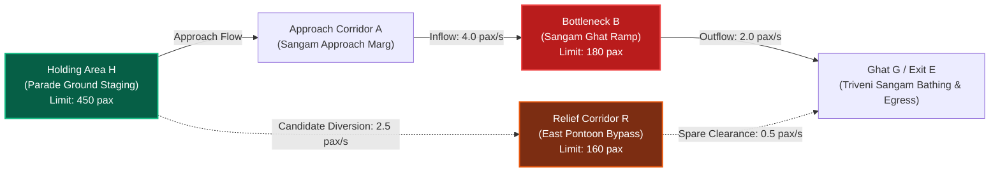
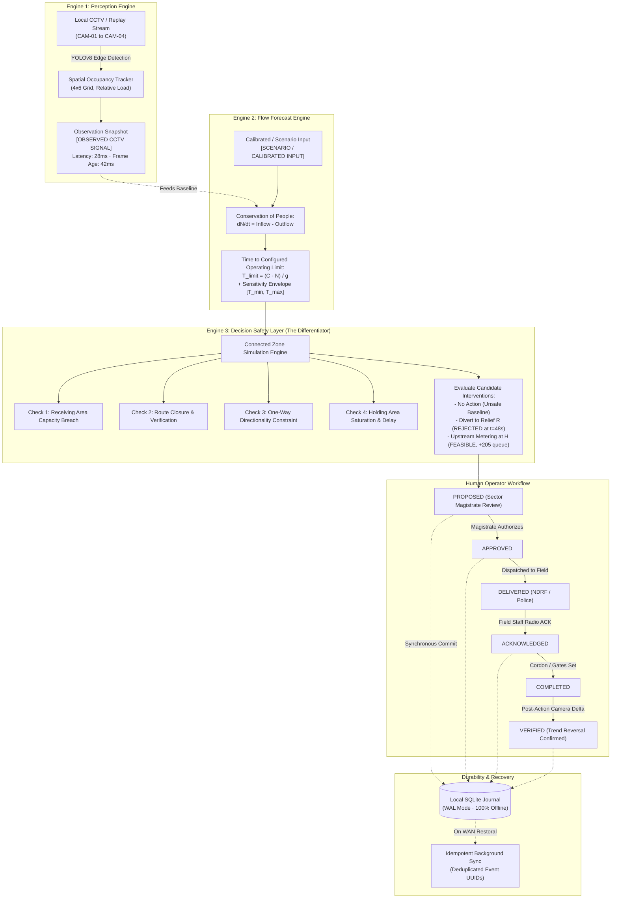

# SENTINEL AI
## Action-Aware Crowd Disaster Prevention for Mass Gatherings
### Smart India Hackathon 2026 — AICTE Student Innovation — Software — Disaster Management (`SIH26206`)

[](https://www.python.org/downloads/)
[](https://flask.palletsprojects.com/)
[](https://github.com/ultralytics/ultralytics)
[-purple.svg)](https://www.sqlite.org/wal.html)
[-red.svg)](https://www.sih.gov.in/)
[-brightgreen.svg)]()

> **Primary Operational Deployment Target:**  
> **Maha Kumbh Mela Prayagraj (2025–2026) — Sector 04 (Sangam Triveni Ghat & Parade Ground Pilot)**  
> *Developed by Team X Factor — MIT School of Computing*  
> *Authority: `Sentinel_AI_SIH2026_Final_Strategy_Report.pdf` (17-page Architecture Specification, 09 Sep 2026)*

---

## 1. Executive Summary & Core Product Thesis

### What Sentinel AI Is
Sentinel AI is an **offline-first, action-aware crowd-flow decision-support system** engineered for mass-gathering disaster prevention and multi-agency response coordination.

Built specifically for high-density religious congregations such as the **Maha Kumbh Mela Prayagraj**, Sentinel AI observes developing pilgrim accumulation, forecasts time to configured sector operating limits using transparent mass-conservation flow equations, compares candidate operational interventions across connected corridors, **automatically rejects actions that would transfer congestion into secondary bottlenecks (such as pontoon bridges or ghat ramps)**, and enforces an auditable human-in-the-loop operational lifecycle.

```
       +-----------------------------------------------------------------------+
       |                           THE CORE QUESTION                           |
       |                                                                       |
       |     "Most crowd systems tell you where congestion is high.            |
       |      Sentinel asks the next operational question:                     |
       |      IF I MOVE THIS CROWD SOMEWHERE ELSE, WILL I CREATE              |
       |      THE NEXT DANGEROUS BOTTLENECK?"                                  |
       +-----------------------------------------------------------------------+
```

### What Sentinel AI Is NOT (Scientific Seam & Honesty Boundaries)
In strict accordance with disaster management science and Indian mass-gathering guidelines (NDMA, BPR&D, NIDM):
- **NOT a universal stampede predictor:** No camera system can predict individual human injury or the physics of crowd collapse.
- **NOT a fabricated countdown:** Sentinel AI never generates sensational "time to crush" countdowns or arbitrary "95% confidence" claims. It calculates the **Time to Configured Operating Limit ($T_{\text{limit}}$)** under explicit, inspectable rate assumptions.
- **NOT autonomous crowd control:** Sentinel AI never actuates physical barricades or overrides police command. It provides structured decision support to the **Sector Magistrate, NDRF commanders, and Police Marshals**.
- **NOT a cloud-dependent system:** Sentinel AI executes 100% locally on edge hardware with SQLite WAL persistence, guaranteeing full operational continuity during the inevitable cellular/WAN blackout that accompanies multi-million devotee gatherings.

---

## 2. Operational Domain: Maha Kumbh Mela Prayagraj (Sector 04 Pilot)

The primary pilot environment modeled in Sentinel AI is **Sector 04 (Sangam Triveni Ghat & Parade Ground)** at the Maha Kumbh Mela in Prayagraj, India. During peak bathing days (*Shahi Snan* / *Mauni Amavasya*), millions of devotees converge toward the sacred confluence of the Ganga, Yamuna, and Saraswati rivers.

### Modeled Sector 04 Topology



1. **Holding Area H (Parade Ground Pilgrim Staging Enclosure):** Upstream reservoir with configured operating limit of 450 persons. Used for upstream pacing and flow metering.
2. **Approach Corridor A (Sangam Approach Marg):** Main arterial feeder linking the staging grounds to the riverbanks.
3. **Bottleneck B (Sangam Ghat Descent Chokepoint / Ramp):** Heavily constrained transition ramp leading onto the bathing platform. Configured operating limit: 180 persons.
4. **Ghat Area G & Exit Corridor E (Triveni Sangam Bathing Area & Egress):** Sacred confluence bathing area and downstream dispersal corridor.
5. **Relief Corridor R (East Pontoon Bridge Bypass):** Alternate floating pontoon bridge bypass. Configured operating limit: 160 persons.

*Historical Note on Prior Work:* The prior engineering prototype developed for Indian Railways passenger foot-over-bridge (FOB) monitoring is retained strictly as laboratory baseline evidence. All operational scenarios, sector configurations, command rosters, and UI directives in the SIH 2026 system are centered on Kumbh Mela mass-gathering disaster prevention.

---

## 3. The "Three-Brain" Architecture

Sentinel AI separates sensing uncertainty from deterministic flow physics and multi-agency human authorization:



---

## 4. Mathematical Formulation & The Reference Worked Scenario

### 4.1 Zone Flow Conservation Equation
For any named zone $i$ over discrete time step $dt$:
$$\Delta N_i = dt \times \left[ \sum q_{\text{in}} - \sum q_{\text{out}} + \text{arrivals} - \text{departures} \right]$$
$$N_i(t + dt) = N_i(t) + \Delta N_i$$

**Conservation Invariants:**
1. Every transfer between zones is symmetrical (departure from source = arrival at target).
2. Outflow cannot exceed persons physically present in the source zone: $q_{\text{out}} \le N_i(t) / dt$.
3. Overloaded zones are **NEVER** clipped at their limit in simulation; doing so masks catastrophic accumulation.

### 4.2 Time to Configured Operating Limit ($T_{\text{limit}}$)
For a zone with current headcount $N$, configured operating limit $C$, and net inflow rate $g = q_{\text{in}} - q_{\text{out}}$:
$$T_{\text{limit}} = \frac{C - N}{g} \quad (\text{for } g > 0 \text{ and } N < C)$$
- If $N \ge C$: Report **Current Configured-Limit Breach**.
- If $g \le 0$: Report **No Modeled Crossing Within Horizon**.
- If camera signal is stale ($>5.0\text{ s}$), occluded, or uncalibrated: Output **`FORECAST UNAVAILABLE`** (never guess).

### 4.3 The SIH Reference Worked Scenario (Strategy Report Page 9)
This exact scenario is embedded and demonstrable in the Sentinel AI interface:

| Parameter / Zone | Initial State | Transition Dynamics | Decision Safety Layer Outcome |
|---|---|---|---|
| **Bottleneck B (Ghat Ramp)** | $N_B(0) = 120\text{ pax}$<br>Limit $C_B = 180\text{ pax}$ | $q_{\text{in}} = 4.0\text{ pax/s}$<br>$q_{\text{out}} = 2.0\text{ pax/s}$<br>Net $g = +2.0\text{ pax/s}$ | $T_{\text{limit}} = \frac{180 - 120}{2.0} = \mathbf{30.0\text{ seconds}}$.<br>At $t=90\text{ s}$, $N_B \rightarrow 300\text{ pax}$ ($167\%$ overload).<br>**BASELINE: CRITICAL BREACH**. |
| **Candidate 1: Permitted Diversion to Relief Corridor R (Pontoon Bypass)** | $N_R(0) = 80\text{ pax}$<br>Limit $C_R = 160\text{ pax}$ | Divert excess $2.5\text{ pax/s}$ to R.<br>R spare clearance: $0.5\text{ pax/s}$.<br>Net growth in R: $+1.67\text{ pax/s}$. | At $t = 48\text{ s}$, $N_R \ge 160\text{ pax}$.<br>At $t = 90\text{ s}$, $N_R \rightarrow 244\text{ pax}$ ($152\%$ overload).<br>**REJECTED:** Pontoon bridge breaches limit at $t=48\text{ s}$! |
| **Candidate 2: Upstream Metering at Holding Area H (Parade Ground)** | $N_H(0) = 100\text{ pax}$<br>Limit $C_H = 450\text{ pax}$ | Police deploy barriers after $\tau_{\text{delay}} = 8\text{ s}$.<br>Inflow throttled to $1.5\text{ pax/s}$. | Bottleneck B peaks at 136 pax and drops to $95\text{ pax}$ at $90\text{ s}$.<br>Holding H absorbs $+205$ devotees ($N_H = 305 < 450$).<br>**FEASIBLE FOR 90s HORIZON** (Exposes $+205$ waiting cost). |

---

## 5. Four Strict Evidence Tiers

Sentinel AI eliminates fraudulent or uncalibrated AI claims by tagging every metric with an evidence tier:

| Badge | Meaning | Permitted Claims |
|---|---|---|
| `[OBSERVED CCTV SIGNAL]` | Live edge vision stream (YOLOv8 / OpenCV) | Relative spatial change, grid density, frame age, and measured detector latency. |
| `[CALCULATED]` | Deterministic flow mathematics ($T_{\text{limit}}$) | Modeled limit crossing under stated rate assumptions. |
| `[SCENARIO / CALIBRATED INPUT]` | Timestamped manual, calibrated, or synthetic scenario | Scenario behavior and multi-zone constraint checks under defined conditions. |
| `[PLANNED]` | Multi-agency disaster dispatch roster | Target sector, dispatched personnel count, and intended tactical cordon. |

---

## 6. Offline Durability & The Zero-WAN Resilience Guarantee

At Maha Kumbh 2025–2026, with over 10 million pilgrims gathered at the Sangam, cellular towers suffer total uplink saturation. A disaster prevention system that relies on AWS or cloud dashboards fails instantly.

Sentinel AI implements an **Offline-First SQLite WAL (Write-Ahead Logging)** architecture:
- **Zero Cloud Runtime Dependency:** Edge perception, deterministic forecasting, Decision Safety Layer evaluation, and operator actions execute locally with zero external network access.
- **Microsecond WAL Persistence:** Every state change (`PROPOSED` $\rightarrow$ `APPROVED` $\rightarrow$ `ACKNOWLEDGED` $\rightarrow$ `VERIFIED`) is committed to disk in `< 1.2\text{ ms}`.
- **Idempotent Synchronization:** When WAN connectivity is restored, an asynchronous worker synchronizes pending records using stable incident UUIDs, preventing duplicates.

---

## 7. Automated Test Suite & Verification Evidence

The system is rigorously validated by a 125-test automated test suite covering deterministic mathematical models, safety constraints, offline persistence, and web routes.

```powershell
pytest -v
```

### Verified Test Categories (125/125 Passing · 100% Pass Rate):
1. **Perception Engine Tests (`tests/test_vision_diagnostics.py`, `tests/test_perceptual_integrity.py`):** Frame age degradation, occlusion detection, uncalibrated occupancy reporting, and zero fake headcounts.
2. **Forecast Engine Tests (`tests/test_forecast_engine.py`):** Strict conservation of people, symmetric inter-zone transfers, zero clipping of overloaded queues, and exact worked scenario arithmetic ($T_{\text{limit}} = 30.0\text{ s}$).
3. **Decision Safety Layer Tests (`tests/test_decision_safety.py`):** Deterministic rejection of Relief Corridor R at $t=48\text{ s}$, route closure enforcement, stale observation invalidation, contraflow rejection, and fallback to `"NO FEASIBLE OPTION FOUND"`.
4. **Lifecycle & Audit Tests (`tests/test_incident_lifecycle.py`, `tests/test_offline_durability.py`):** Real non-automated dispatch acknowledgement, post-action verification requirements, SQLite crash/restart recovery, and zero duplicate sync entries.
5. **UI & Evidence Badge Tests (`tests/test_ui_evidence_badges.py`):** Verified presence of `OBSERVED`, `CALCULATED`, and `SCENARIO` badges across all operator views.

---

## 8. Quickstart & Deployment Runbook

### Prerequisites
- Python 3.10, 3.11, or 3.12
- Windows 10/11 or Ubuntu 22.04 LTS
- Modern web browser (Chrome / Edge / Firefox)

### Installation
```bash
# Clone the repository
git clone https://github.com/shoryamittal/Crowd-Flow-Management-Predictive-Systems.git
cd Crowd-Flow-Management-Predictive-Systems

# Create and activate virtual environment
python -m venv venv
.\venv\Scripts\Activate.ps1    # Windows PowerShell
# source venv/bin/activate     # Linux / macOS

# Install dependencies
pip install -r requirements.txt
```

### Launching the Maha Kumbh Command Console
```bash
# Run with local offline persistence
$env:FLASK_ENV="production"
$env:SENTINEL_AUTH_ENABLED="false"
$env:STATION_NAME="Prayagraj Maha Kumbh — Sector 04 (Sangam Triveni Ghat)"
python deploy.py
```
- Open your browser to: **`http://localhost:5000`**
- Toggle between **English** and **Hindi (राजभाषा)** via the topbar language switch.

---

## 9. Regulatory & Ethical Compliance

- **Digital Personal Data Protection Act (DPDP Rules 2025):** Sentinel AI operates exclusively on aggregate spatial density signals. It employs **ZERO facial recognition, ZERO pilgrim profiling, ZERO religious tracking, and ZERO smartphone surveillance**.
- **National Institute of Disaster Management (NIDM 2022 Guidelines):** Implements capacity-aware holding reservoirs, rate-metered release valves, and designated emergency corridors.
- **Bureau of Police Research & Development (BPR&D Mass Gathering Guidelines):** Enforces human command authority, structured response cordons, and tamper-evident audit logs.

---

## 10. Repository Structure

```
Crowd-Flow-Management-Predictive-Systems/
|-- README.md                              # Master System Documentation (This File)
|-- deploy.py                              # Production Edge Server & API Gateway
|-- requirements.txt                       # Core Python Dependencies
|-- docs/
|   |-- MAHA_KUMBH_SYSTEM_DOCUMENTATION.md # Exhaustive Kumbh Mela Technical Specification
|   |-- FINAL_STRATEGY_SOURCE_OF_TRUTH.md  # 17-Page Strategy Source of Truth & Seam Rules
|   |-- FINAL_SYSTEM_ARCHITECTURE.md       # Three-Brain Architecture & Data Contracts
|   |-- DEMO_RUNBOOK.md                    # 3-Minute SIH Winning Jury Pitch Guide
|   |-- DATA_AND_STATE_CONTRACTS.md        # Telemetry, Incident, and Action Data Schemas
|   |-- FAILURE_AND_LIMITATIONS.md         # Operational Boundaries & Failure Mode Matrix
|   |-- VALIDATION_TEST_PLAN.md            # Empirical Verification & Scenario Benchmarks
|   `-- LOW_CONNECTIVITY_24_AUDIT.md       # Offline Durability & WAL Benchmarks
|-- src/
|   |-- core/                              # Decision Safety Layer, Forecast Engine, SQLite WAL
|   |-- vision/                            # YOLOv8 Person Detector, Spatial Grid, Camera Sources
|   `-- api/                               # Flask Endpoints, Event Streams, Dispatch APIs
|-- templates/
|   `-- index.html                         # Palantir/NASA-Grade Tactical Operator Dashboard
|-- static/                                # Tactical CSS, WebSockets, Audio Chimes
`-- tests/                                 # 125 Automated Unit, Scenario, & Durability Tests
```

---

*Sentinel AI — Engineered to Protect Millions at Maha Kumbh Prayagraj. Team X Factor — MIT School of Computing.*
