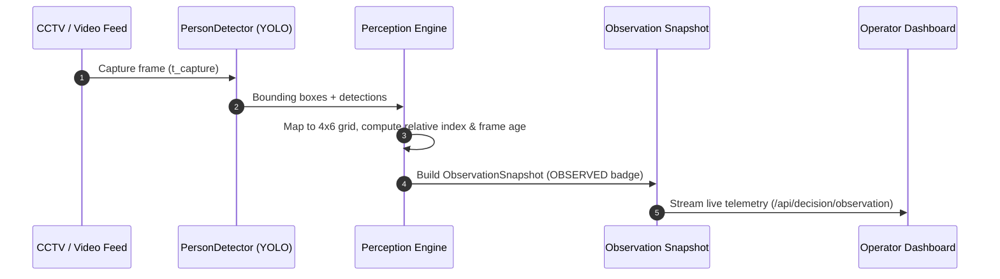
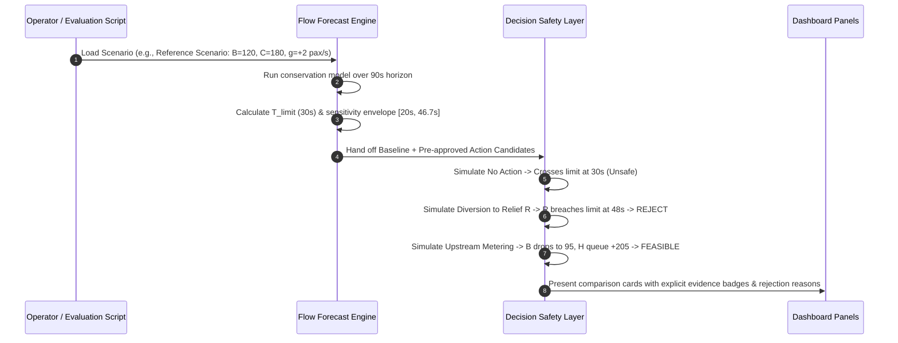
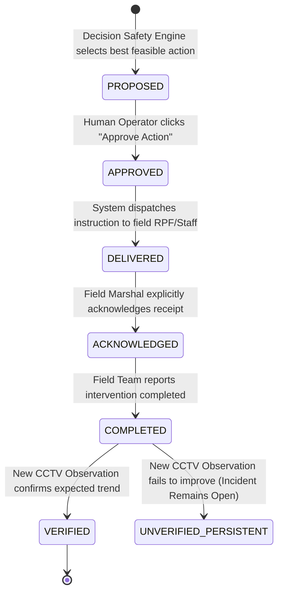
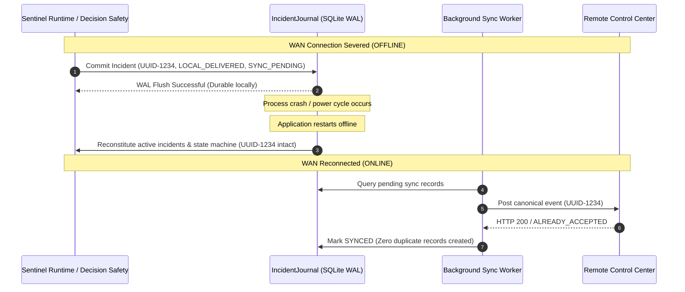
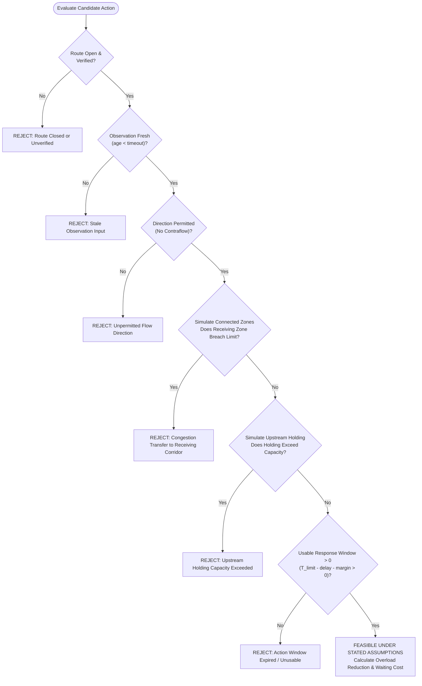

# SENTINEL AI — Final System Architecture Specification

**Authority:** `Sentinel_AI_SIH2026_Final_Strategy_Report.pdf`  
**Target:** Smart India Hackathon 2026  
**Implementation Standard:** Deterministic, offline-first decision support  

---

## 1. High-Level Architectural Model (The "Three-Brain" Engine)

Sentinel AI decomposes crowd disaster prevention into three distinct, inspectable analytical engines backed by a local human-in-the-loop workflow and an immutable offline journal.

```mermaid
graph TD
    subgraph "Input Layer"
        CAM["CCTV / Replay Stream"] -->|OpenCV / YOLO| ENG1["1. PERCEPTION ENGINE<br/>(What is happening?)"]
        SCEN["Manual / Calibrated Scenario"] -->|Parameters| ENG2["2. FLOW FORECAST ENGINE<br/>(What happens if nothing changes?)"]
    end

    ENG1 -->|Observation Snapshot<br/>(OBSERVED badge)| ENG2
    ENG2 -->|Forecast Snapshot<br/>(T_limit, Sensitivity)| ENG3["3. DECISION SAFETY ENGINE<br/>(What should we do?)"]

    subgraph "Decision Safety Layer"
        CAND["Candidate Actions:<br/>- No Action<br/>- Metering<br/>- Diversion"] --> ENG3
        CONSTR["Safety Constraints:<br/>- Receiving Zone Capacity<br/>- Holding Capacity<br/>- Route Open / Verified<br/>- Directionality<br/>- Evidence Freshness"] --> ENG3
    end

    ENG3 -->|Evaluated Candidates<br/>(Feasible vs Rejected)| WORKFLOW["HUMAN OPERATOR WORKFLOW<br/>(Who authorizes and confirms?)"]

    subgraph "Operator Lifecycle"
        WORKFLOW --> PROP["PROPOSED"]
        PROP -->|Operator Approves| APPR["APPROVED"]
        APPR -->|System Dispatches| DELIV["DELIVERED"]
        DELIV -->|Field Staff Acknowledges| ACK["ACKNOWLEDGED"]
        ACK -->|Field Execution Finishes| COMP["COMPLETED"]
        COMP -->|New Post-Action Observation| VERIF["VERIFIED"]
    end

    subgraph "Persistence & Continuity"
        WORKFLOW -.->|Synchronous Commit| JOURNAL[("OFFLINE INCIDENT JOURNAL<br/>(SQLite / WAL)")]
        JOURNAL -.->|Replay on Reconnect| SYNC["Background Sync Worker<br/>(Idempotent UUID Replay)"]
    end
```

---

## 2. Core Engines Description

### 2.1 Engine 1 — Perception Engine (*What is happening?*)
- **Purpose:** Converts video frames from edge cameras or licensed video replays into timestamped spatial occupancy and trend signals.
- **Components:** `FrameSource` (Camera/Video), `PersonDetector` (YOLOv8 nano/small), 4×6 spatial grid mapper, and adaptive change tracker.
- **Output:** `ObservationSnapshot`
- **Output Attributes:** `snapshot_id`, `source`, `source_type`, `observed_at`, `frame_age_ms`, `zone_id`, `observed_value`, `unit`, `evidence_status` (`OBSERVED`), `quality_state` (`LIVE` / `STALE` / `CAMERA_LOST`), `calibration_state` (`UNCALIBRATED`).
- **Safety Boundary:** Does NOT claim exact headcount or people/$\text{m}^2$ when operating without geometric calibration. Reports relative occupancy index and frame age honestly.

### 2.2 Engine 2 — Flow Forecast Engine (*What happens if nothing changes?*)
- **Purpose:** Determines if and when a configured zone operating limit will be crossed under prevailing flow rates using a deterministic, inspectable conservation model.
- **Conservation Equation:**
  $$\Delta N_i = dt \times \left[ \sum \text{inflow} - \sum \text{outflow} + \text{arrivals} - \text{departures} \right]$$
  $$N_i(t + dt) = N_i(t) + \Delta N_i$$
- **Conservation Invariants:**
  1. Every transfer from Zone A to Zone B is symmetrical: departure from A, arrival at B.
  2. Physical outflow cannot exceed people present in the source zone: $\text{outflow} \le N_A(t) / dt$.
  3. Overloaded zones are **NEVER** artificially clipped at their operating limits in simulation (doing so masks catastrophic accumulation).
  4. Zero stochastic/random jitter in decision calculations; results are 100% reproducible.
- **Time to Configured Operating Limit ($T_{\text{limit}}$):**
  For current count $N$, operating limit $C$, and net growth rate $g = \text{inflow} - \text{outflow}$:
  $$T_{\text{limit}} = \frac{C - N}{g} \quad (\text{for } g > 0 \text{ and } N < C)$$
  - If $N \ge C$: Report **Current Configured-Limit Breach**.
  - If $g \le 0$: Report **No Modeled Crossing Within Horizon**.
  - If data is stale, units are inconsistent, or calibration is missing: Report **`FORECAST UNAVAILABLE`**.
- **Sensitivity Range:** Computes an envelope $[T_{\min}, T_{\max}]$ across specified parameter ranges (e.g., $N \in [110, 130]$, $g \in [1.5, 2.5]\text{ pax/s}$). Labeled explicitly as *"Sensitivity range under stated assumptions"*, NEVER *"95% confidence"*.

### 2.3 Engine 3 — Decision Safety Engine (*What should we do?*)
- **Brand / Feature Name:** **DECISION SAFETY LAYER**
- **Core Principle:** Before recommending moving people away from an emerging chokepoint, the system simulates all connected receiving areas and evaluates where those people will go.
- **Candidate Actions Evaluated:**
  1. `NO ACTION`: Baseline unmitigated evolution.
  2. `UPSTREAM METERING`: Throttle inflow at upstream holding reservoir (e.g., reduce inflow to $1.5\text{ pax/s}$ after staff delay $\tau_{\text{delay}} = 8\text{ s}$).
  3. `PERMITTED DIVERSION`: Reroute excess flow into candidate relief corridor.
- **Hard Constraint Checks (Automatic Rejection):**
  - Route marked `CLOSED` or `UNVERIFIED`.
  - Stale observation feeding the candidate route.
  - Route direction violation (contraflow against one-way passenger movement).
  - Receiving zone operating limit breach (congestion transfer).
  - Upstream holding area capacity breach.
  - Expired recommendation or stale situational evidence.
- **Two-Stage Action Ranking:**
  - **Stage 1:** Prune all candidate actions that fail any hard constraint.
  - **Stage 2:** Rank surviving feasible actions by:
    1. Lowest modeled peak overload in the primary chokepoint.
    2. Lowest waiting/delay cost imposed on upstream holding zones.
    3. Lowest operational complexity for security/RPF marshals.
  - **Fail-Safe Fallback:** If all candidate actions violate safety constraints, the system explicitly returns: **`NO FEASIBLE OPTION FOUND`**. It **never** forces an unsafe green recommendation.

---

## 3. Data Flow Diagrams

### 3.1 Live Observation Data Flow


### 3.2 Decision Scenario Data Flow


### 3.3 Operator Action Lifecycle Flow


### 3.4 Offline Incident Journal & Recovery Replay Flow


### 3.5 Decision Safety Layer Detailed Evaluation Flow


---

## 4. Operational Sectors & Schematic Zone Graph

The sector is modeled as a connected directed graph of named operational zones:

```
[ Holding Area (H) ] --- Route H->A ---> [ Approach Corridor (A) ]
         |                                           |
         | Route H->R (Alternate)                    v
         v                                [ Bottleneck Chokepoint (B) ]
[ Relief Corridor (R) ]                              |
         |                                           v
         | Route R->E                     [ Ghat / Dispersal Area (G) ]
         |                                           |
         +-------------------------------------------+
                                 |
                                 v
                         [ Exit Zone (E) ]
```

### Zone Parameters (Default SIH Reference Configuration)
1. **Holding Area `H`:** Initial $N=100$, Capacity Limit $C=450$, Role: `HOLDING_AREA`
2. **Approach Corridor `A`:** Initial $N=50$, Capacity Limit $C=200$, Role: `APPROACH_CORRIDOR`
3. **Bottleneck `B`:** Initial $N=120$, Operating Limit $C=180$, Role: `BOTTLENECK`
4. **Ghat / Dispersal `G`:** Initial $N=250$, Capacity Limit $C=1000$, Role: `DISPERSAL_DESTINATION`
5. **Relief Corridor `R`:** Initial $N=80$, Operating Limit $C=160$, Role: `RELIEF_CORRIDOR`
6. **Exit Area `E`:** Initial $N=40$, Capacity Limit $C=500$, Role: `EGRESS_EXIT`

---

## 5. Architectural Invariants

1. **Safety Plane Isolation:** The perception loop, local decision evaluation, local alerting, and SQLite WAL logging execute locally on the host machine without any network call.
2. **No Autonomous Gate Control:** Sentinel AI presents recommendations to authorized human operators; it never commands mechanical actuators directly.
3. **Transparent Evidence Labels:** Every metric must carry an explicit evidence status (`OBSERVED`, `CALCULATED`, `SCENARIO`, `PLANNED`).
4. **Durable Identity Stability:** Incident UUIDs and Action UUIDs are generated once and remain invariant across local persistence, restart, and remote synchronization.
5. **No Forced Green Recommendations:** If all proposed interventions fail safety constraints, the system explicitly returns `NO FEASIBLE OPTION FOUND`.
